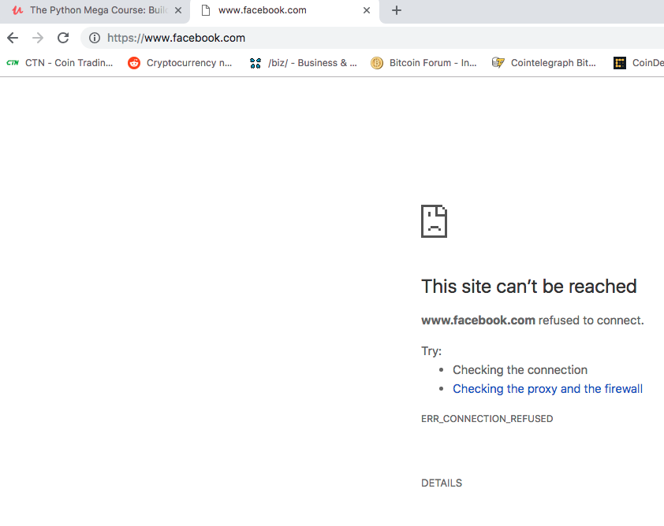

# Python Website Blocker 
### This is an application built with python that will block certain websites from being able to be accessed during work hours (8 AM to 4 PM). 

This program will check the current time every 5 seconds by using a `while` loop and the package `datetime`. If the current time is between 8 AM and 4 PM then it will open the `hosts` file and write in the website names that we want to block. The `hosts` file contains the mappings of IP addresses that are linked to host names. 

This is what a sample hosts file may look like. Here we are linking the Facebook website with our localhost IP adress `127.0.0.1`. 
``` 
# HOST FILE 
## 
127.0.0.1 localhost 
255.255.255.255 broadcasthost 
::1 localhost 

127.0.0.1 www.facebook.com 
127.0.0.1 facebook.com 
``` 

When we try to access the Facebook website, the broswer will redirect us to our localhost IP address instead. Since the Facebook website does not exist on our localhost, the broswer will give us back an error page instead. This is the error page that the browser gives us when we try to access Facebook during work hours  

If the current time is not during work hours, then it will open the hosts file and remove the website names so that they will not be blocked anymore using the `truncate()` method.

**_This is perfect for preventing employees from visiting certain websites on work computers, restricting website access to kids, or to just simply help you avoid distractions!_**
